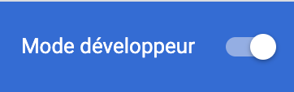
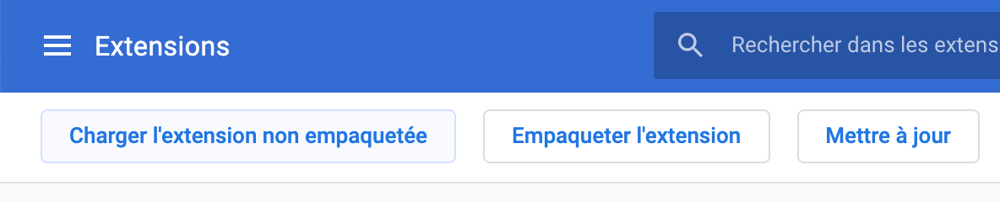
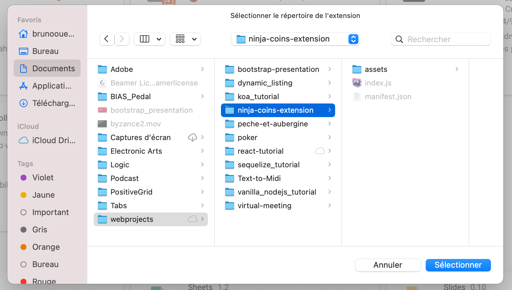
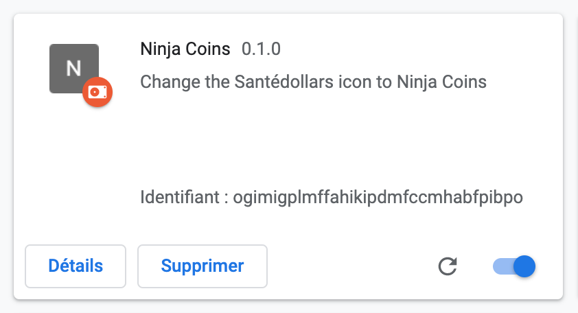

# Ninja Coins
Une extension Google Chrome pour changer les Santédollars en Ninja Coins dans l'application Être en Santé.

## Procédure d'installation
* Téléchargez ce dépôt sur votre poste en local

* Dans Google Chrome, naviguez sur [chrome://extensions/](chrome://extensions/)

* En haut à droite, assurez-vous que le Mode développeur est activé

* En haut à gauche, cliquez sur **Charger l'extension non empaquetée**

* Sélectionnez ce dossier dans votre système de fichier

* L'extension devrait se trouver dans la liste de vos extensions

### Félicitations! Maintenant, allez gagner des Ninja Coins!

## *TODO:*
* Les remplacements de texte ne fonctionnent pas toujours pour le bilan des activités et l'historique car ce sont des sections loadées en AJAX. À fixer.